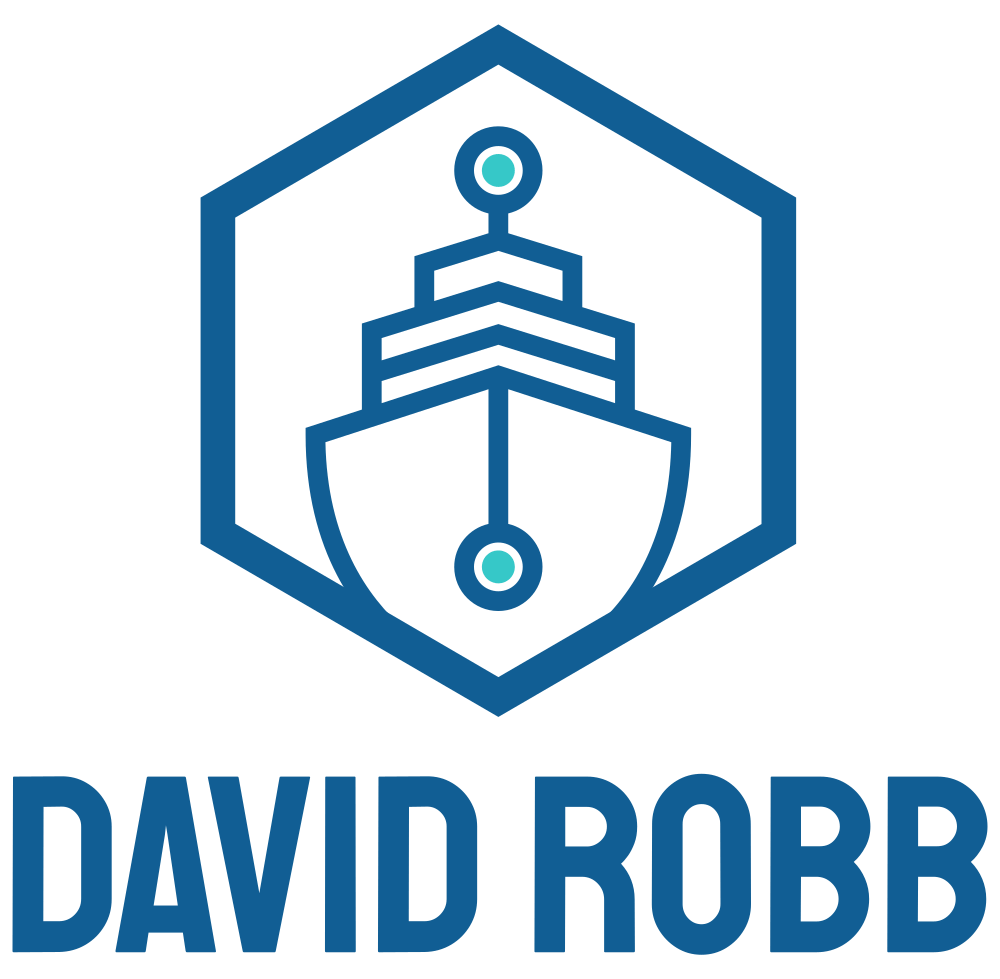

<div id="top"></div>
<!--
*** Thanks for checking out the Best-README-Template. If you have a suggestion
*** that would make this better, please fork the repo and create a pull request
*** or simply open an issue with the tag "enhancement".
*** Don't forget to give the project a star!
*** Thanks again! Now go create something AMAZING! :D
-->

<!-- PROJECT SHIELDS -->
<!--
*** I'm using markdown "reference style" links for readability.
*** Reference links are enclosed in brackets [ ] instead of parentheses ( ).
*** See the bottom of this document for the declaration of the reference variables
*** for contributors-url, forks-url, etc. This is an optional, concise syntax you may use.
*** https://www.markdownguide.org/basic-syntax/#reference-style-links
-->
[![Contributors][contributors-shield]][contributors-url]
[![Forks][forks-shield]][forks-url]
[![Stargazers][stars-shield]][stars-url]
[![Issues][issues-shield]][issues-url]
[![MIT License][license-shield]][license-url]
[![LinkedIn][linkedin-shield]][linkedin-url]
[![Facebook][facebook-shield]][facebook-url]
[![instagram][instagram-shield]][instagram-url]

<!-- PROJECT LOGO -->
<br />
<div align="center">
  <a href="https://github.com/drobb2020/django-tasker">
    
  </a>

<h3 align="center">Django Todo Project</h3>

  <p align="center">
    This is a basic django application to hone my skills on creating a task / todo list, along with an authentication and user profile system.
    <br />
    <a href="https://github.com/drobb2020/django-tasker"><strong>Explore the docs »</strong></a>
    <br />
    <br />
    <a href="https://github.com/drobb2020/django-tasker">View Demo</a>
    ·
    <a href="https://github.com/drobb2020/django-tasker/issues">Report Bug</a>
    ·
    <a href="https://github.com/drobb2020/django-tasker/issues">Request Feature</a>
  </p>
</div>

<!-- TABLE OF CONTENTS -->
<details>
  <summary>Table of Contents</summary>
  <ol>
    <li>
      <a href="#about-the-project">About The Project</a>
      <ul>
        <li><a href="#built-with">Built With</a></li>
      </ul>
    </li>
    <li>
      <a href="#getting-started">Getting Started</a>
      <ul>
        <li><a href="#prerequisites">Prerequisites</a></li>
        <li><a href="#installation">Installation</a></li>
      </ul>
    </li>
    <li><a href="#usage">Usage</a></li>
    <li><a href="#roadmap">Roadmap</a></li>
    <li><a href="#contributing">Contributing</a></li>
    <li><a href="#license">License</a></li>
    <li><a href="#contact">Contact</a></li>
    <li><a href="#acknowledgments">Acknowledgments</a></li>
  </ol>
</details>

<!-- ABOUT THE PROJECT -->
## About The Project

![Django Tasker][product-screenshot]

This is a basic Django application, originally built in Django 4.2.x and now upgraded to Django 5.1.4. It includes a todo application, a user registration, login, logout, and profile methods.

<p align="right">(<a href="#top">back to top</a>)</p>

### Built With

* [Django](https://www.djangoproject.com/)
* [Bootstrap](https://getbootstrap.com/)
* [Font Awesome](https://fontawesome.com/)

<p align="right">(<a href="#top">back to top</a>)</p>

<!-- GETTING STARTED -->
## Getting Started

Feel free to clone or download the project. You must have Python installed on your system, and please create a virtual environment for the required packages for the project.

### Prerequisites

This is an example of how to list things you need to use the software and how to install them.

* Python

  * macOS

      Download the most recent version of Python that you have installed. You will require at least Python 3.6. I am currently using Python 3.13.1. Download the universal2 installer to accommodate either an Intel or ARM processor

  * Windows

      Download the most recent version of Python that you have installed. You will require at least Python 3.6. I am currently using Python 3.13.1.Download either the 64bit or 32bit version based on your current installation.

### Installation

1. Clone the Repo from github.

  ```sh
    git clone https://github.com/drobb2020/django-tasker.git
  ```

2. Change (cd) into the cloned directory.
3. Create a Python virtual environment.

  ```sh
    python -m venv venv
  ```

4. Run pip install -r requirements.txt, and pip install -r requirements-dev.txt.
5. Run the project (python manage.py runserver).
6. Stop the server (CTRL+c).
7. Migrate the models and create the sqlite3 database (python manage.py migrate).
8. Create a superuser (python manage.py createsuperuser).
9. Enjoy!

<p align="right">(<a href="#top">back to top</a>)</p>

<!-- USAGE EXAMPLES -->
## Usage

The interface is self-explanatory. Go to your dashboard and click on the New Task link at the top of the page to add your first task. If you click on the Task Detail link you will be able to edit, or delete the task. On the edit page you will be able to mark the task as complete.

On the menu bar there is an account link that will allow you to view and edit your profile.

_For more examples, please refer to the [Documentation](https://example.com)_

<p align="right">(<a href="#top">back to top</a>)</p>

<!-- ROADMAP -->
## Roadmap

See the [open issues](https://github.com/drobb2020/django-tasker/issues) for a full list of proposed features (and known issues).

<p align="right">(<a href="#top">back to top</a>)</p>

<!-- CONTRIBUTING -->
## Contributing

Contributions are what make the open source community such an amazing place to learn, inspire, and create. Any contributions you make are **greatly appreciated**.

If you have a suggestion that would make this better, please fork the repo and create a pull request. You can also simply open an issue with the tag "enhancement".
Don't forget to give the project a star! Thanks again!

1. Fork the Project
2. Create your Feature Branch (`git checkout -b feature/AmazingFeature`)
3. Commit your Changes (`git commit -m 'Add some AmazingFeature'`)
4. Push to the Branch (`git push origin feature/AmazingFeature`)
5. Open a Pull Request

<p align="right">(<a href="#top">back to top</a>)</p>

<!-- LICENSE -->
## License

Distributed under the MIT License. See `LICENSE.txt` for more information.

<p align="right">(<a href="#top">back to top</a>)</p>

<!-- CONTACT -->
## Contact

David Robb - drobb2011@gmail.com

Project Link: [https://github.com/drobb2020/django-tasker](https://github.com/drobb2020/django-tasker)

<p align="right">(<a href="#top">back to top</a>)</p>

<!-- MARKDOWN LINKS & IMAGES -->
<!-- https://www.markdownguide.org/basic-syntax/#reference-style-links -->
[contributors-shield]: https://img.shields.io/github/contributors/drobb2020/django-tasker.svg?style=for-the-badge
[contributors-url]: https://github.com/drobb2020/django-tasker/graphs/contributors
[forks-shield]: https://img.shields.io/github/forks/drobb2020/django-tasker.svg?style=for-the-badge
[forks-url]: https://github.com/drobb2020/django-tasker/network/members
[stars-shield]: https://img.shields.io/github/stars/drobb2020/django-tasker.svg?style=for-the-badge
[stars-url]: https://github.com/drobb2020/django-tasker/stargazers
[issues-shield]: https://img.shields.io/github/issues/drobb2020/django-tasker.svg?style=for-the-badge
[issues-url]: https://github.com/drobb2020/django-tasker/issues
[license-shield]: https://img.shields.io/github/license/drobb2020/django-tasker.svg?style=for-the-badge
[license-url]: https://github.com/drobb2020/django-tasker/blob/master/LICENSE.txt
[linkedin-shield]: https://img.shields.io/badge/-LinkedIn-black.svg?style=for-the-badge&logo=linkedin&colorB=555
[linkedin-url]: https://www.linkedin.com/in/david-robb-42436a20/
[facebook-shield]: https://img.shields.io/badge/-Facebook-black.svg?style=for-the-badge&logo=linkedin&colorB=555
[facebook-url]: https://www.facebook.com/david.robb.2012/
[instagram-shield]: https://img.shields.io/badge/-Instagram-black.svg?style=for-the-badge&logo=linkedin&colorB=555
[instagram-url]: https://www.instagram.com/davidrobb169/
[product-screenshot]: ./static/images/screenshot.png
